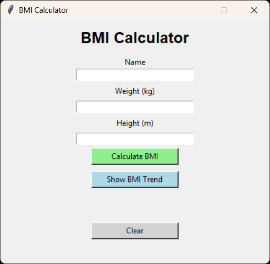
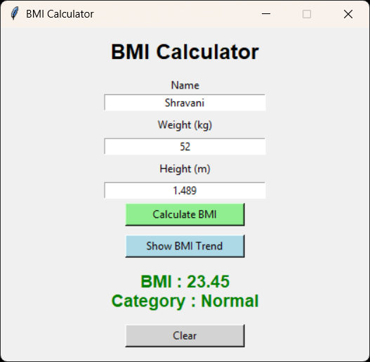
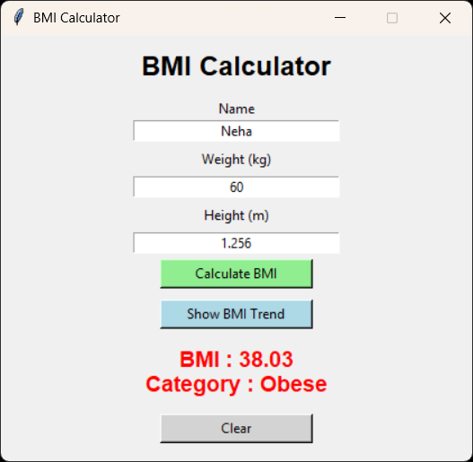
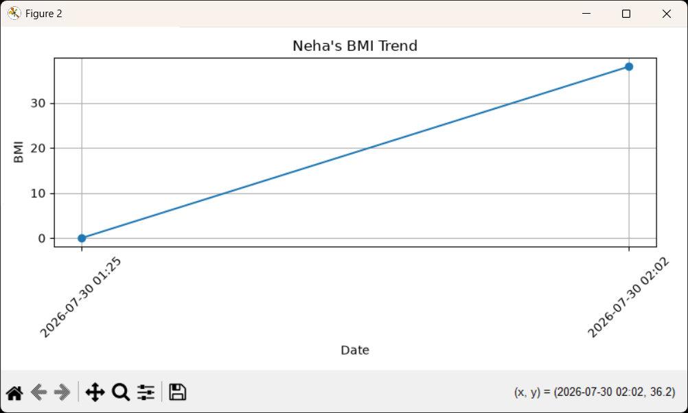
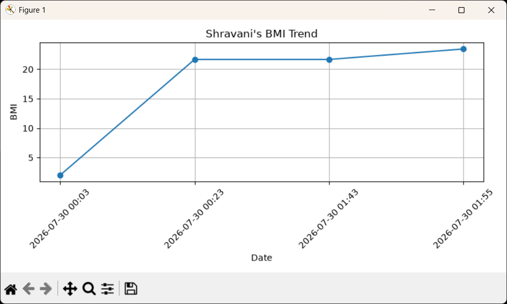

# 🩺 BMI Calculator

A modern **Python GUI-based BMI Calculator** that calculates Body Mass Index (BMI), classifies users into standard health categories, stores BMI records in an **SQLite database**, and visualizes BMI history using **Matplotlib**.

This project demonstrates GUI development, database management, input validation, and data visualization using Python.

---

## ✨ Features

- 🖥️ Interactive GUI built with Tkinter
- 📏 Calculate BMI using weight and height
- 🎯 Automatic BMI classification
  - Underweight
  - Normal Weight
  - Overweight
  - Obese
- 🎨 Color-coded BMI results
- 👥 Multi-user support
- 💾 Store BMI records in SQLite database
- 📈 Visualize BMI history with Matplotlib
- ⚠️ Input validation and error handling
- 🧹 Clear input fields with a single click

---

## 📸 Screenshots

### 🏠 Main Interface



---

### ✅ Normal BMI Result



---

### ⚠️ Overweight BMI Result



---

### 🚨 Obese BMI Trend Graph



---

### 📈 BMI Trend Graph



---


## 🛠️ Tech Stack

- **Language:** Python
- **GUI:** Tkinter
- **Database:** SQLite3
- **Visualization:** Matplotlib

---

## 📂 Project Structure

```
BMI_Calculator/
│── bmi_calculator.py
│── bmi.db
│── requirements.txt
│── README.md
│── .gitignore
└── screenshots/
    ├── main_gui.png
    ├── bmi_result.png
    └── bmi_graph.png
    ├── overweight_result.png
    └── obese_graph.png


```

---

## 🧮 BMI Formula

```
BMI = Weight (kg) / Height² (m²)
```

### BMI Categories

| BMI Range | Category |
|-----------:|----------|
| Less than 18.5 | Underweight |
| 18.5 – 24.9 | Normal Weight |
| 25.0 – 29.9 | Overweight |
| 30.0 and above | Obese |

---

## 🚀 Getting Started

### Clone the Repository

```bash
git clone https://github.com/Shraaavani/BMI_Calculator.git
```

### Navigate to the Project

```bash
cd BMI_Calculator
```

### (Optional) Create a Virtual Environment

```bash
python -m venv venv
```

### Activate the Virtual Environment

**Windows**

```bash
venv\Scripts\activate
```

### Install Dependencies

```bash
pip install -r requirements.txt
```

### Run the Application

```bash
python bmi_calculator.py
```

---

## 💡 How to Use

1. Enter your **Name**
2. Enter your **Weight (kg)**
3. Enter your **Height (m)**
4. Click **Calculate BMI**
5. View your BMI value and health category
6. Your record is automatically saved to the SQLite database
7. Click **Show BMI Trend** to view your BMI history graph
8. Click **Clear** to reset all input fields

---

## 💾 Database

The application stores BMI records in an SQLite database (`bmi.db`) with the following information:

- Name
- Weight
- Height
- BMI
- Date & Time

This allows multiple users to maintain their BMI history over time.

---

## 📈 Data Visualization

The application generates a **line chart** using Matplotlib to display BMI trends for individual users based on their stored records.

---

## ⚠️ Input Validation

The application validates:

- Empty input fields
- Non-numeric values
- Negative or zero weight
- Negative or zero height

User-friendly error messages are displayed using Tkinter message boxes.

---

## 📚 Learning Outcomes

This project helped me learn:

- Python GUI development with Tkinter
- Event-driven programming
- SQLite database integration
- CRUD database operations
- Input validation
- Exception handling
- Data visualization with Matplotlib

---

## 🚀 Future Enhancements

- Export BMI records to CSV or PDF
- User authentication
- Dark mode support
- Health recommendations based on BMI
- Diet and workout suggestions
- Edit/Delete previous BMI records

---

## 👩‍💻 Author

**Shravani Santosh Kamble**

- 🔗 GitHub: https://github.com/Shraaavani
- 💼 LinkedIn: https://www.linkedin.com/in/shravani-kamble-9b9345346/

---

## ⭐ Support

If you found this project useful, please consider **starring** the repository. It helps support my work and motivates me to build more projects.

---
**Made with ❤️ using Python**
